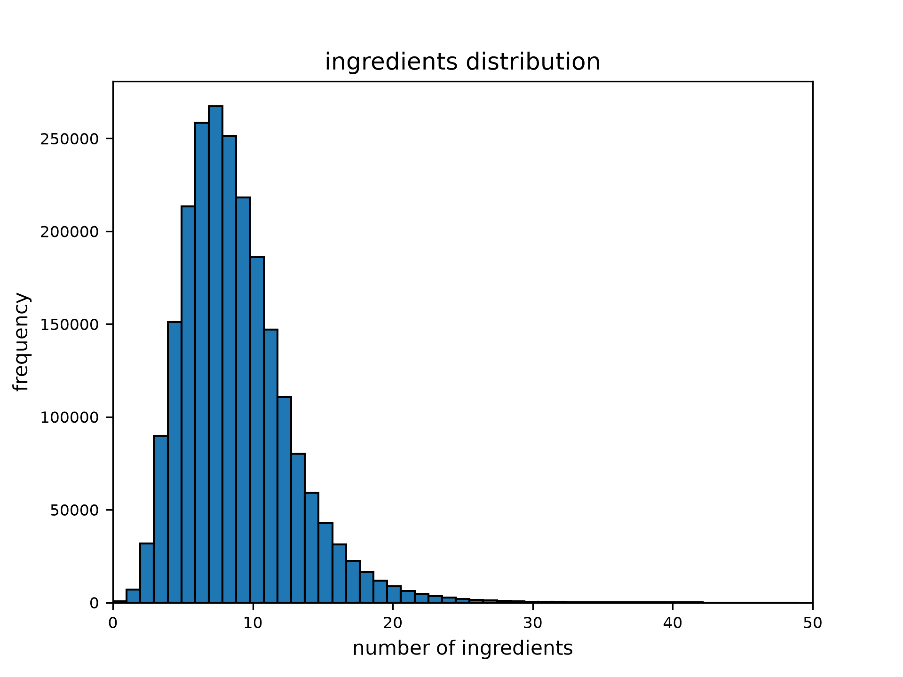
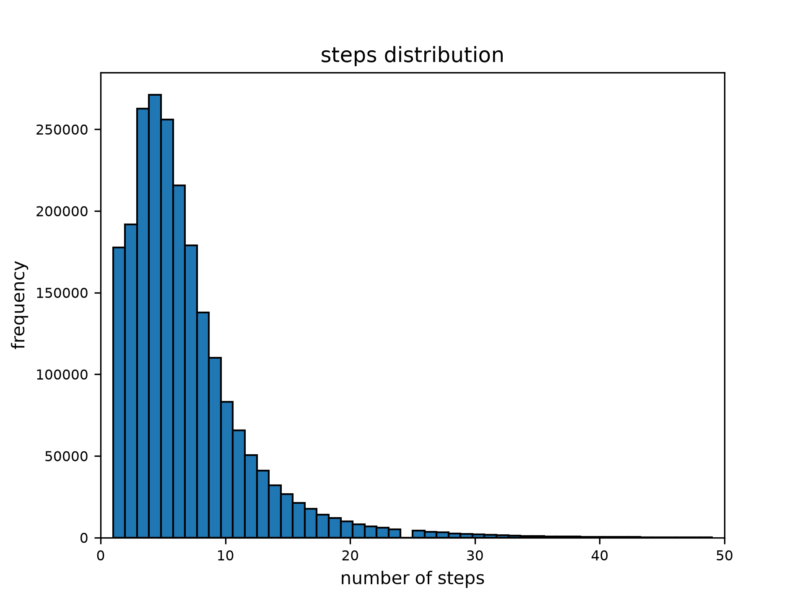
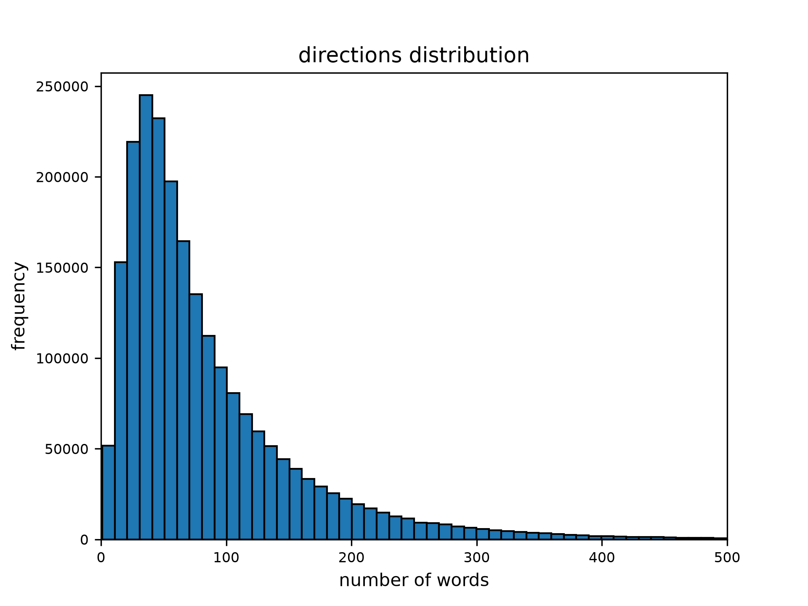
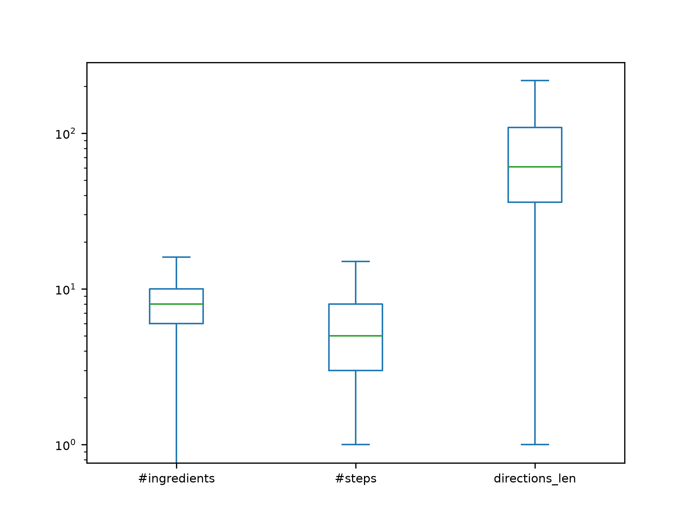
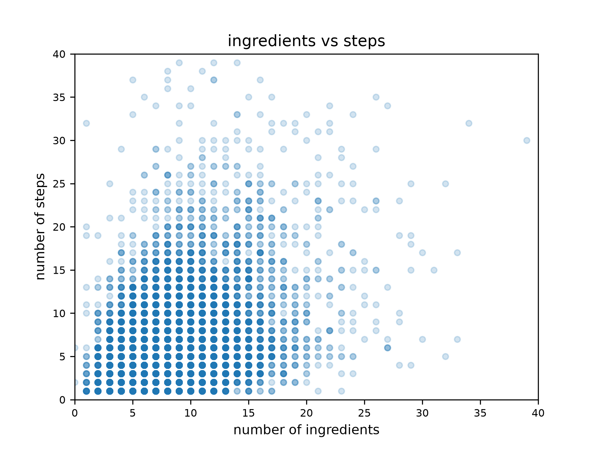
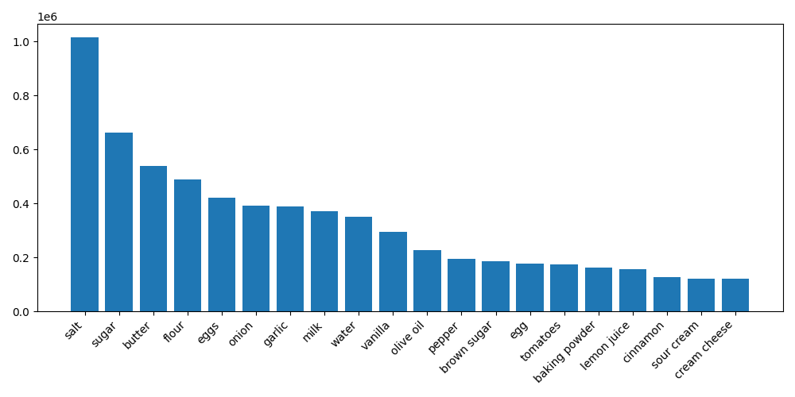
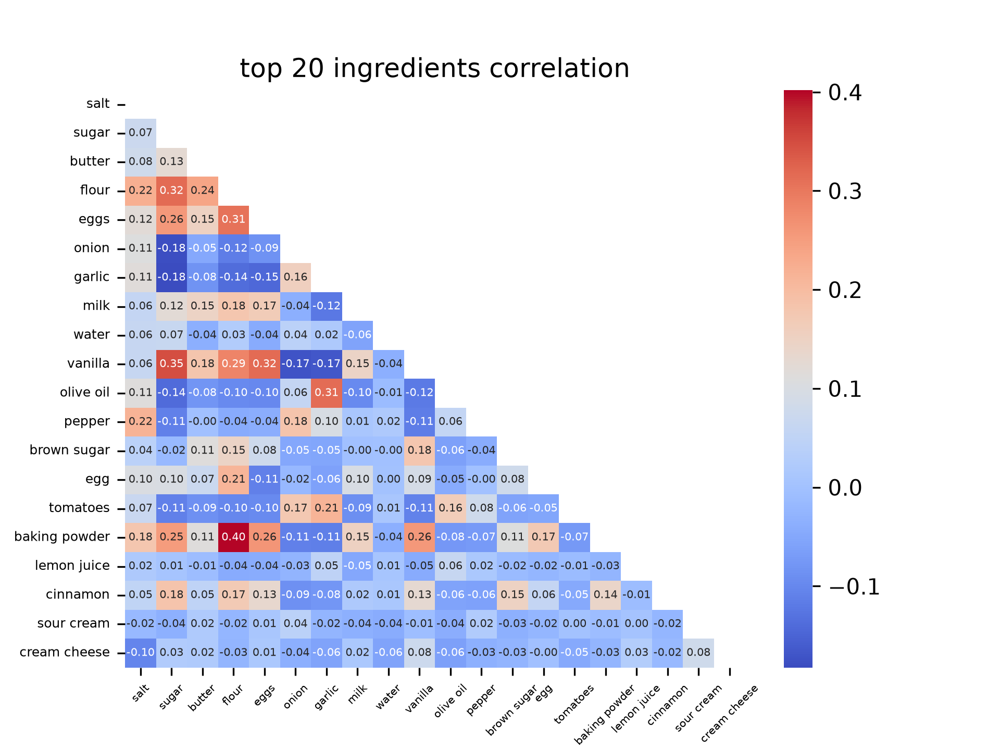

# EDA (Exploratory Data Analysis)

## Indice

- [Overview](#overview)
- [Analisi duplicati](#analisi-duplicati)
- [Distribuzione degli ingredienti](#distribuzione-degli-ingredienti)
- [Distribuzione degli step](#distribuzione-degli-step)
- [Distribuzione delle istruzioni](#distribuzione-delle-istruzioni)
- [Relazione tra ingredienti e step](#relazione-tra-ingredienti-e-step)
- [Ingredienti più frequenti](#ingredienti-più-frequenti)
- [Correlazione tra gli ingredienti](#correlazione-tra-gli-ingredienti)

## Overview

Dallo studio del dataset **RecipeNLG** sono emersi i seguenti punti: 

-   dimensione: 2.1 GB
-   righe: 2 231 142 (ogni riga rappresenta una ricetta)
-   colonne: 7

    |   Colonna  |  Tipo  | Elementi null | Elementi duplicati |             Descrizione              |
    |   :-----   | :-----:|    :-----:    |      :-----:       |                :-----                |
    | Unnamed: 0 | int64  |       0       |         0          | identificatore univoco della ricetta |
    | title      |  str   |       1       |      918 271       | titolo della ricetta                 |
    | ingredients|  str   |       0       |        4 780       | dosi degli ingredienti               |
    | directions |  str   |       0       |       19 498       | istruzioni della ricetta             |
    | link       |  str   |       0       |         0          | url della ricetta originale          |
    | source     |  str   |       0       |      2 231 140     | fonte di provenienza della ricetta   |
    | NER        |  str   |       0       |       97 646       | lista degli ingredienti              |

## Analisi duplicati

Il dataset presenta degli elementi duplicati che verranno adesso analizzati tramite i seguenti dati:

|  Colonna   | Elementi unici |   Media   | Deviazione standard |    Min    |    25%    |    50%    |    75%    |    Max    |
| :--------- |  :---------:   |:---------:|     :---------:     |:---------:|:---------:|:---------:|:---------:|:---------:|
| title      |    1 312 870   | 1.699438  |      13.59383       |     1     |     1     |     1     |     1     |   4 099   |
| ingredients|    2 226 362   | 1.002147  |     0.06684430      |     1     |     1     |     1     |     1     |     28    |
| directions |    2 211 644   | 1.008816  |      0.4389496      |     1     |     1     |     1     |     1     |    274    |
| NER        |    2 133 496   | 1.045768  |      0.7292958      |     1     |     1     |     1     |     1     |    573    |

Si noti che questi dati sono stati generati prendendo in considerazione l'intera lista di dosi/istruzioni/ingredienti in ogni riga. Stiamo quindi analizzando quante volte quelle stesse liste compaiono all'interno del dataset.

Guardando la tabella notiamo che in media ogni titolo è presente 1.7 volte, ma il 75% delle ricette è presente singolarmente. Questo ci dice che in generale ci sono molte ricette uniche in quanto i titoli duplicati sono sbilanciati verso alcune preparazioni, come "Chicken Casserole" che è presente 4099 volte. Notiamo però anche che le liste di dosi, istruzioni e ingredienti sono quasi sempre uniche. Quindi anche se alcuni titoli sono condivisi, la preparazione di una stessa ricetta può differire a seconda degli ingredienti.

Le osservazioni appena fatte vengono confermate dall'unicità di ogni riga del dataset. Non esistono infatti ricette con stesso titolo, ingredienti, istruzioni e dosi.

## Distribuzione degli ingredienti

La distribuzione degli ingredienti segue l'andamento di una gaussiana, dove la maggior parte delle ricette contiene fra i 3-13 ingredienti con dei picchi di concentrazione intorno ai 7-9. Questo ci dice che nel dataset sono presenti principalmente ricette semplici che richiedono un numero limitato di ingredienti. Notiamo anche che ci sono ricette con 0 ingredienti, 573 in totale.

Il grafico viene mostrato per le ricette fino a 50 ingredienti per motivi di leggibilità. Sono tuttavia poche, 58, le ricette che superano questa soglia.

## Distribuzione dei passaggi

La distribuzione dei passaggi segue un andamento simile alla distribuzione degli ingredienti. La maggior parte delle ricette contiene meno di 15 passaggi con dei picchi di concentrazione intorno ai 3-5. Anche in questo caso notiamo che sono presenti molte ricette con pochi passaggi, mentre sono un numero inferiore quelle più complesse.

Il grafico viene mostrato per le ricette fino a 50 step per motivi di leggibilità. Sono tuttavia poche, 1242, le ricette che superano questa soglia.

## Distribuzione delle istruzioni

Questa volta notiamo una differenza. La maggior parte delle ricette contiene delle istruzioni lunghe fra le 20-100 parole con dei picchi di concentrazione intorno alle 30-60. Notiamo però che la distribuzione è più dilatata rispetto ai due casi precedenti, quindi il numero di parole nelle istruzioni di una ricetta è più variabile al numero di ingredienti e il numero di passaggi.

Il grafico viene mostrato per le ricette fino a 500 parole per motivi di leggibilità. Sono tuttavia poche, 8311, le ricette che superano questa soglia.

## Boxplot delle distribuzioni

L’ultima considerazione fatta nel paragrafo precedente viene messa in luce con questo grafico. Il numero di ingredienti e il numero di passaggi è abbastanza compatto, mentre il numero di parole delle istruzioni è più variabile, in quanto una ricetta può essere descritta in maniera sintetica o più dettagliata.

## Relazione tra ingredienti e passaggi

Il grafico è stato generato prendendo 10 000 punti casuali con numero di ingredienti e passaggi minore di 40.

Come possiamo vedere, si ha una grande densità di ricette fino ai 15 ingredienti e passaggi. La relazione tra questi non è tuttavia lineare: due ricette con numero di ingredienti simile possono avere un numero di passaggi diverso tra loro (vale anche il viceversa).

## Ingredienti più frequenti

Come prevedibile, gli ingredienti maggiormente presenti sono quelli di uso comune. In primis troviamo le spezie. Seguono poi gli ingredienti che stanno alla base della maggior parte delle ricette.

## Correlazione tra gli ingredienti

Sopra è mostrata la relazione tra i 20 ingredienti più comuni. Una relazione positiva indica che due ingredienti tendono ad essere insieme in una ricetta. Al contrario, una relazione negativa indica che due ingredienti tendono a evitarsi.

Per esempio, come siamo abituati a pensare, due ingredienti salati tendono a stare nella stessa ricetta mentre uno dolce e uno salato no. Il grafico ci conferma proprio questo: ad esempio farina e lievito compaiono molte volte insieme, mentre aglio e zucchero tendono a evitarsi.