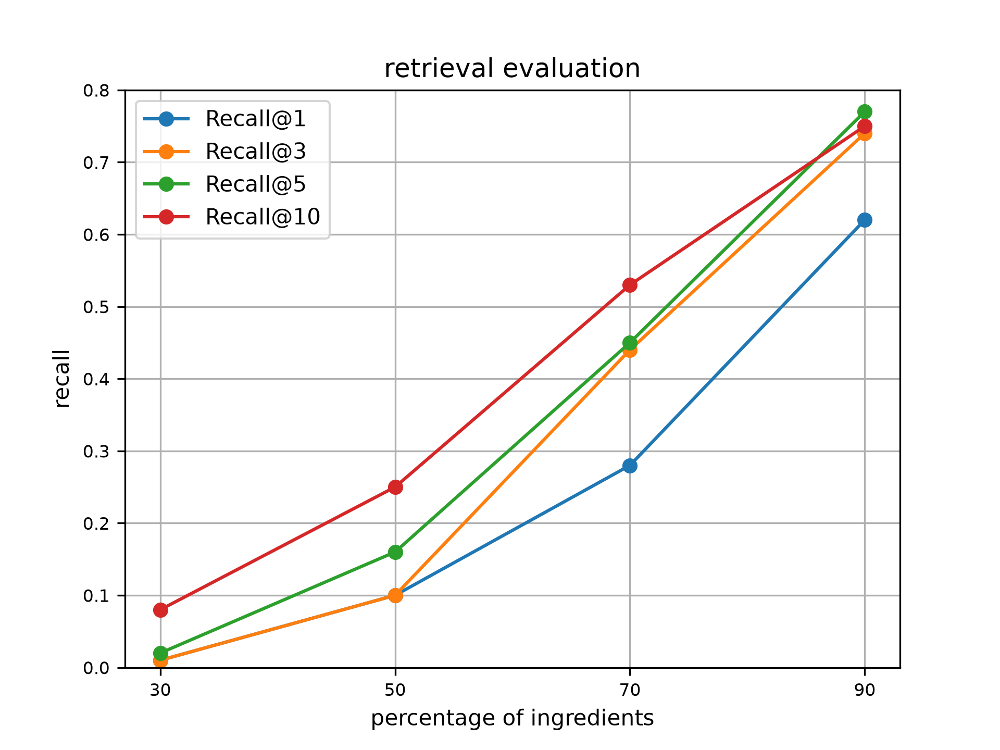

# Evaluation

La valutazione del modello è stata fatta prendendo in esame la metrica **Recall@N**. Questa tecnica consiste nel trovare la proporzione fra il numero di documenti rilevanti recuperati e il numero di tutti i documenti rilevanti disponibili nella collezione considerata.

Per implementare la valutazione è stato preso un campione casuale di ricette dal dataset. Poi, per ogni ricetta di questo campione, è stato preso un sottoinsieme di ingredienti e dato come input al modello, che ritornerà le N ricette più simili. Il risultato ottenuto viene così confrontato con la ricetta originale per capire se questa è stata trovata e restituita dal modello.

Tradotta al nostro caso d'uso la Recall@N è quindi espressa dalla seguente formula: $$Recall@N = (correct) / (tested)$$ dove:
- *correct* è il numero di volte che una ricetta è stata trovata fra le prime *N*
- *tested* è il numero di volte che è stato effettuato l'esperimento

## Interpretazione Grafica

Il seguente grafico mostra come si comporta il modello al variare del parametro *N* e della percentuale di ingredienti presa da una ricetta.

